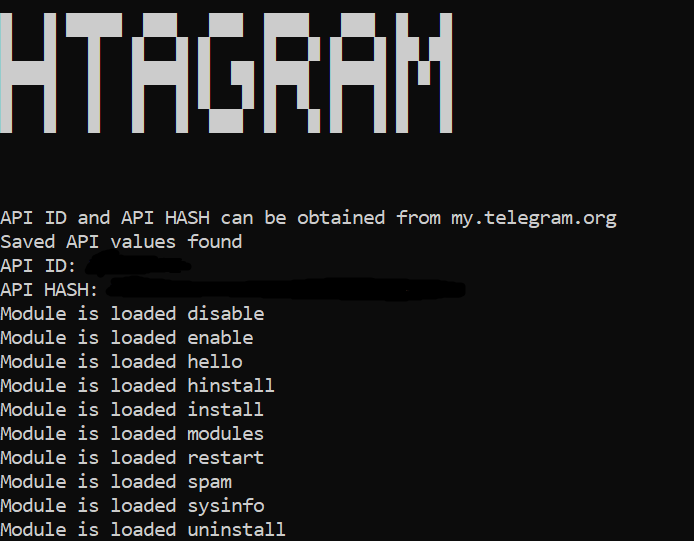

# HTaGram - Tiny Userbot

HTaGram is a lightweight, modular Telegram userbot built with Telethon. It's designed to be simple, extensible, and easy to use.

## Features

- **Lightweight** - Minimal resource usage
- **Modular** - Easy to add/remove modules
- **Simple setup** - Just enter API credentials
- **Persistent** - Saves your API values
-  **Auto-restart** - Automatically restarts after module changes

## Requirements

- Python 3.8+
- Telegram API ID & API Hash (get from [my.telegram.org](https://my.telegram.org))

## Installation

```bash
# Clone the repository
git clone https://github.com/elitrycraft/htagram.git
cd htagram

# Install dependencies
pip install -r requirements.txt

# Run the userbot
python main.py
```

## Previews


